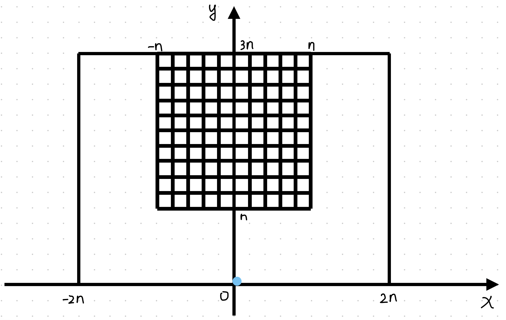
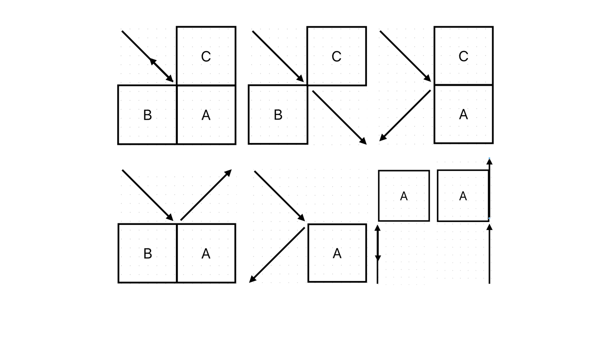

# Problem 021 - Snooker Brick Out!

**ACMOJ Problem ID**: 1933

## Table of Contents

- [Problem 021 - Snooker Brick Out!](#problem-021---snooker-brick-out)
  - [Table of Contents](#table-of-contents)
  - [Problem Description](#problem-description)
    - [Game Mechanics](#game-mechanics)
    - [Collision Rules](#collision-rules)
    - [Scoring Rules](#scoring-rules)
  - [Scoring Formula](#scoring-formula)
    - [Game Score Component (90%)](#game-score-component-90)
    - [Control Count Component (10%)](#control-count-component-10)
  - [Input Format](#input-format)
  - [Output Format](#output-format)
  - [Data Constraints](#data-constraints)
  - [Important Notes](#important-notes)
  - [Test Data](#test-data)
  - [Per-Testcase Resource Limits](#per-testcase-resource-limits)
  - [Game Simulator](#game-simulator)
  - [Submission Requirements](#submission-requirements)
    - [File Preparation](#file-preparation)
    - [Submission Guidelines](#submission-guidelines)
    - [Evaluation Notes](#evaluation-notes)
    - [Academic Integrity](#academic-integrity)

## Problem Description

**Reference Repository**: The game simulator is available at https://github.com/zsworld6/Snooker-Brick-Out-publish

The TA was idly browsing and discovered a small game called [*Brick Out*](https://en.wikipedia.org/wiki/Breakout_(video_game)), which basically involves controlling a paddle to bounce a ball to hit bricks. One night, the TA dreamed of a variant of *Brick Out*. In the dream game, the map size is $4n \times 3n$, with a total of $2n \times 2n$ bricks. Each brick is a $1 \times 1$ square, positioned in the centered upper $2n$ height of the map. There is a ball with negligible size that starts at the center of the bottom of the map, with an initial velocity of $1$ downward and $0$ horizontal velocity.



### Game Mechanics

Every time the ball touches the bottom edge of the map, you can decide to:
- **Operation A**: Horizontal velocity $+2$ to the left
- **Operation B**: Horizontal velocity $+1$ to the left  
- **Operation C**: Horizontal velocity remains unchanged
- **Operation D**: Horizontal velocity $+1$ to the right
- **Operation E**: Horizontal velocity $+2$ to the right

### Collision Rules

The ball undergoes perfectly elastic collisions whenever it touches a brick or the map boundary. 

Special positioning rules:
- When moving vertically up and down, the ball is considered to be at grid nodes and positioned on the right side.
- When the ball vertically touches the left corner of a brick, the brick is considered hit and removed, and the ball bounces.
- When the ball vertically touches the right corner of a brick, it is considered not to have touched.
- In other cases, when the ball's direction of movement changes, the corresponding brick $A$ is considered hit.

For specific collision scenarios, see the example image. All rotations of each case are considered equivalent.



### Scoring Rules

When a brick is hit:
- The brick disappears
- Score increases by $+1$

Most bricks are white (represented by color $0$). Some colored bricks are randomly distributed with colors $1-3$. If you hit $3$ bricks consecutively in the order $1-2-3$ (collisions with map boundaries are allowed in between), you receive an additional skill bonus of $50$ points.

Your task is to write a program to help the TA complete this game efficiently and with a high score!

## Scoring Formula

**IMPORTANT: This is not a traditional problem. You should not expect to achieve a perfect score.**

### Grade Composition

| Component | Percentage |
| :--: | :--: |
| OJ Score | 80% |
| Code Review | 20% |

On the OJ, each test point's score consists of two components: game score and control count. The game score accounts for $90\%$, and the control count score accounts for $10\%$.

### Game Score Component (90%)

The scoring formula for the game score component is: $\displaystyle \frac{V_{get}}{V_{max}}$

Where:
- $V_{get}$ is the actual score obtained during execution
- $V_{max}$ is the theoretical maximum score

### Control Count Component (10%)

The scoring formula for the control count component is: $\displaystyle e^{-\frac{p}{2n^2}}$

Where:
- $p = \min(t, m)$, which is the actual number of controls simulated by the simulator
- $t$ is your actual control count
- $m$ is the maximum allowed operation count

**IMPORTANT: If you fail to hit all bricks, you will not receive any control count score.**

## Input Format

Line 1: An integer $k$, representing the test point number, where $k \in [10]$.

Line 2: An integer $n$.

Line 3: An integer $m$, representing the upper limit of allowed operations.

Line 4: An integer $s$, representing the number of colored bricks of each color in the data.

Next $2n$ lines: Each line contains $2n$ integers separated by spaces, representing the color of the brick at the corresponding position.

## Output Format

Output $t$ consecutive lines, each containing a single uppercase letter from $A$ to $E$, representing the operation to be performed after each time the ball touches the bottom surface of the map.

## Data Constraints

For $100\%$ of test points:
- $1 \le n \le 1 \times 10^3$
- $m \ge 16n^2$
- The number of colored bricks of each color is equal
- The total number of colored bricks is less than $n^2$

## Important Notes

**WARNING: Any attempt to attack the evaluation machine or exploit bugs will result in a zero score.**

There are a total of $10$ test points, of which $5$ are provided. There is also a naive sample case that is not included in the OJ evaluation, located at `/workspace/data/021/testcases/`.

## Test Data

The test data for this problem is located at `/workspace/data/021/testcases/`, containing:
- `naive.in` / `naive.out` - A simple sample case (not included in OJ evaluation)
- `1.in` through `5.in` - Five provided test cases

## Per-Testcase Resource Limits

- **Time Limit (per test case)**: 5000 ms (minimum), 50000 ms (maximum)
- **Memory Limit (per test case)**: 1024 MiB
- **Disk Usage**: Disk access is not permitted

## Game Simulator

A game simulator is available in the [Snooker-Brick-Out-publish](https://github.com/zsworld6/Snooker-Brick-Out-publish) repository.

**Key Information:**
- Any code from `game.h` in the repository can be used in your final submission.
- For detailed usage instructions of the `Game` class, please refer to the `README.md` in the repository.

## Submission Requirements

### OJ Git Repository Compilation Process

For Git compilation, we will first clone the repository using a command similar to:
```bash
git clone <repo_url> . --depth 1 --recurse-submodules --shallow-submodules --no-local
```

Then we check if there is a `CMakeLists.txt` file. If it exists, we run (if not, a warning message will be displayed):
```bash
cmake .
```

Finally, we check if there is any of `GNUmakefile`/`makefile`/`Makefile` (if cmake was run previously, this will be the generated Makefile). If it exists, we run (if not, a warning message will be displayed):
```bash
make
```

After this process is complete, we will use the `code` file in the project root directory as the compilation result.

The local environment has gcc-13 and g++-13 available.

### Git Configuration Requirements

**IMPORTANT**: You must create a `.gitignore` file in your project root directory to avoid OJ evaluation conflicts.

The `.gitignore` file should include at least the following entries:

```gitignore
CMakeFiles/
CMakeCache.txt
```

### Submission Guidelines

- The submitted code must be able to compile successfully through the above compilation process
- The compiled executable file name must be `code`
- The program must be able to read data from standard input and write results to standard output
- You can use any code from `game.h` from the [Snooker-Brick-Out-publish](https://github.com/zsworld6/Snooker-Brick-Out-publish) repository in your submission
- Ensure your solution balances both game score and operation efficiency
- Please ensure the code runs correctly within the given time and memory limits
- **You must use C++ or C language** to implement this assignment

### Evaluation Notes

- The evaluation system will test your program using both provided and hidden test data
- Your score is calculated based on the scoring formula described above
- Partial credit is awarded based on both game score and control efficiency
- Optimize your strategy to maximize both components of the score
- Please pay attention to both correctness and efficiency of your solution
- Exceeding time or memory limits will be judged as the corresponding error type

### Academic Integrity

If any violations are found during evaluation or code review (including but not limited to using unconventional methods to pass test cases or attacking the evaluation system), your final score may be significantly reduced or become **0 points**.

